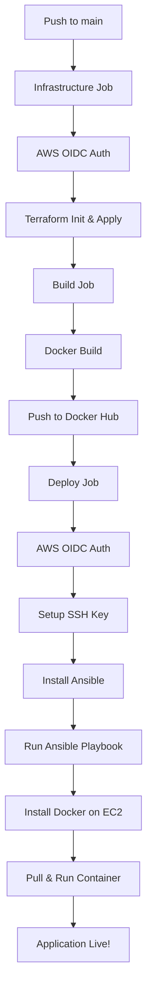

# Terra-Ansible Demo 🚀

A complete **Infrastructure as Code (IaC)** demonstration showcasing automated deployment of a Spring Boot application to AWS EC2 using **Terraform**, **Ansible**, **Docker**, and **GitHub Actions**.

## 📋 Table of Contents

- [Overview](#overview)
- [Architecture](#architecture)
- [Tech Stack](#tech-stack)
- [Project Structure](#project-structure)
- [Prerequisites](#prerequisites)
- [Getting Started](#getting-started)
  - [Local Development](#local-development)
  - [Infrastructure Setup](#infrastructure-setup)
  - [CI/CD Pipeline](#cicd-pipeline)
- [Configuration](#configuration)
  - [GitHub Secrets & Variables](#github-secrets--variables)
  - [Terraform Configuration](#terraform-configuration)
  - [Ansible Configuration](#ansible-configuration)
- [API Endpoints](#api-endpoints)
- [Deployment Flow](#deployment-flow)
- [Contributing](#contributing)
- [License](#license)

---

## Overview

This project demonstrates a modern DevOps workflow that automates the entire software delivery lifecycle:

1. **Infrastructure Provisioning** - Terraform creates AWS EC2 instances with proper networking
2. **Containerization** - Docker packages the Spring Boot application
3. **Configuration Management** - Ansible configures servers and deploys containers
4. **CI/CD Automation** - GitHub Actions orchestrates the entire pipeline

## Architecture

```
┌─────────────────────────────────────────────────────────────────────────────┐
│                            GitHub Actions CI/CD                             │
├─────────────────┬─────────────────────────────┬─────────────────────────────┤
│   Infrastructure│          Build              │          Deploy             │
│      Job        │          Job                │          Job                │
│                 │                             │                             │
│  ┌───────────┐  │  ┌───────────────────────┐  │  ┌───────────────────────┐  │
│  │ Terraform │  │  │   Docker Build/Push   │  │  │  Ansible Playbook     │  │
│  │   Init    │  │  │                       │  │  │                       │  │
│  │   Apply   │  │  │  ┌─────────────────┐  │  │  │  ┌─────────────────┐  │  │
│  └─────┬─────┘  │  │  │  Spring Boot    │  │  │  │  │ Install Docker  │  │  │
│        │        │  │  │  Application    │  │  │  │  │ Pull Image      │  │  │
│        ▼        │  │  └────────┬────────┘  │  │  │  │ Run Container   │  │  │
│  ┌───────────┐  │  │           │           │  │  │  └────────┬────────┘  │  │
│  │  AWS EC2  │  │  │           ▼           │  │  │           │           │  │
│  │ Instance  │  │  │  ┌─────────────────┐  │  │  │           ▼           │  │
│  │  + VPC    │  │  │  │   Docker Hub    │  │  │  │  ┌─────────────────┐  │  │
│  │  + SG     │  │  │  │   Registry      │  │  │  │  │  EC2 Instance   │  │  │
│  └───────────┘  │  │  └─────────────────┘  │  │  │  │  Port 80        │  │  │
│                 │  │                       │  │  │  └─────────────────┘  │  │
└─────────────────┴──┴───────────────────────┴──┴──┴───────────────────────┴──┘
```

## Tech Stack

| Category               | Technology      | Version |
| ---------------------- | --------------- | ------- |
| **Backend**            | Spring Boot     | 4.0.1   |
| **Language**           | Java            | 25      |
| **Build Tool**         | Gradle          | 9.1.0   |
| **IaC**                | Terraform       | Latest  |
| **Config Management**  | Ansible         | Latest  |
| **Containerization**   | Docker          | Latest  |
| **Cloud Provider**     | AWS (EC2, VPC)  | -       |
| **CI/CD**              | GitHub Actions  | -       |
| **Container Registry** | Docker Hub      | -       |
| **Terraform Backend**  | Terraform Cloud | -       |

## Project Structure

```
terra-ansible-demo/
├── 📁 .github/
│   ├── 📁 actions/
│   │   └── 📁 aws_auth/          # Reusable AWS OIDC auth action
│   │       └── action.yml
│   └── 📁 workflows/
│       └── deploy.yml            # Main CI/CD pipeline
├── 📁 ansible/
│   ├── ansible.cfg               # Ansible configuration
│   ├── aws_ec2.yml               # Dynamic AWS inventory
│   └── playbook.yml              # Deployment playbook
├── 📁 src/
│   └── 📁 main/
│       ├── 📁 java/com/meet/terraansibledemo/
│       │   ├── TerraAnsibleDemoApplication.java
│       │   └── TestController.java
│       └── 📁 resources/
│           └── application.properties
├── 📁 terraform/
│   ├── main.tf                   # EC2, VPC, Security Group
│   ├── output.tf                 # Output variables
│   ├── provider.tf               # AWS provider config
│   ├── terraform.tf              # Terraform Cloud backend
│   ├── variables.tf              # Input variables
│   └── tf-ansible.pem.pub        # SSH public key
├── Dockerfile                    # Production multi-stage build
├── build.gradle                  # Gradle build configuration
└── README.md
```

## Prerequisites

- **Java 25** or later
- **Gradle 9.1+**
- **Docker** & Docker Compose
- **Terraform CLI**
- **Ansible** with `boto3` and `botocore`
- **AWS CLI** (configured with credentials)
- **AWS Account** with appropriate IAM permissions
- **Terraform Cloud** account (for remote state)
- **Docker Hub** account

## Getting Started

### Local Development

1. **Clone the repository:**

   ```bash
   git clone https://github.com/your-username/terra-ansible-demo.git
   cd terra-ansible-demo
   ```

2. **Run the application locally:**

   ```bash
   ./gradlew bootRun
   ```

   The application will be available at `http://localhost:80`

3. **Build the Docker image:**
   ```bash
   docker build -t terra-ansible-demo .
   docker run -p 80:80 terra-ansible-demo
   ```

### Infrastructure Setup

1. **Configure Terraform Cloud:**
   - Create an organization and workspace in [Terraform Cloud](https://app.terraform.io)
   - Update `terraform/terraform.tf` with your organization and workspace names

2. **Generate SSH Key Pair:**

   ```bash
   ssh-keygen -t rsa -b 4096 -f terraform/tf-ansible.pem -N ""
   mv terraform/tf-ansible.pem ~/.ssh/
   chmod 400 ~/.ssh/tf-ansible.pem
   ```

3. **Initialize and Apply Terraform:**

   ```bash
   cd terraform
   terraform init
   terraform plan
   terraform apply
   ```

4. **Run Ansible Playbook:**
   ```bash
   cd ansible
   export DOCKERHUB_USERNAME=your-username
   export DOCKERHUB_TOKEN=your-token
   export DOCKERHUB_IMAGE=terra-ansible
   ansible-playbook -i aws_ec2.yml playbook.yml
   ```

### CI/CD Pipeline

The GitHub Actions workflow automatically:

1. **Infrastructure Job:** Provisions AWS infrastructure via Terraform
2. **Build Job:** Builds and pushes Docker image to Docker Hub
3. **Deploy Job:** Configures EC2 and deploys the application via Ansible

Trigger: Push to `main` branch (excluding markdown files)

## Configuration

### GitHub Secrets & Variables

Configure these in your GitHub repository settings:

#### Secrets

| Name              | Description                          |
| ----------------- | ------------------------------------ |
| `AWS_ROLE_ARN`    | IAM role ARN for OIDC authentication |
| `TF_API_TOKEN`    | Terraform Cloud API token            |
| `DOCKERHUB_TOKEN` | Docker Hub access token              |
| `SSH_KEY`         | Base64-encoded SSH private key       |

#### Variables

| Name                 | Description         |
| -------------------- | ------------------- |
| `DOCKERHUB_USERNAME` | Docker Hub username |
| `DOCKERHUB_IMAGE`    | Docker image name   |

### Terraform Configuration

| Variable            | Default                 | Description                |
| ------------------- | ----------------------- | -------------------------- |
| `ec2_instance_type` | `t3.micro`              | EC2 instance type          |
| `ec2_ami_id`        | `ami-02b8269d5e85954ef` | Ubuntu AMI ID (ap-south-1) |

**AWS Resources Created:**

- EC2 Instance with 25GB gp3 volume
- Security Group (ports 22, 80)
- Key Pair for SSH access

### Ansible Configuration

**ansible.cfg:**

- Remote user: `ubuntu`
- Python interpreter: `/usr/bin/python3`
- SSH key: `~/.ssh/tf-ansible.pem`
- Host key checking: Disabled

**Dynamic Inventory (aws_ec2.yml):**

- Region: `ap-south-1`
- Filter: Instances tagged with `Name: tf-ansible`
- Groups by tag name

## API Endpoints

| Method | Endpoint | Description                        |
| ------ | -------- | ---------------------------------- |
| GET    | `/`      | Returns "Hello from Spring Boot!"  |
| GET    | `/test`  | Returns HTML page with server info |

### Sample `/test` Response

```html
🚀 Spring Boot Application is Running! Status: Up and Running Timestamp:
2026-01-17T18:30:00 Hostname: ip-172-31-x-x Active Profiles: [] Port: 80
```

## Deployment Flow



## Security Considerations

- **OIDC Authentication:** Uses AWS OIDC for secure, keyless authentication from GitHub Actions
- **Security Groups:** Only ports 22 (SSH) and 80 (HTTP) are exposed
- **Secrets Management:** Sensitive data stored in GitHub Secrets
- **SSH Key Handling:** Private key stored as base64-encoded secret

## Troubleshooting

### Common Issues

1. **Terraform state lock:**

   ```bash
   terraform force-unlock <LOCK_ID>
   ```

2. **Ansible connection timeout:**
   - Ensure EC2 instance is running
   - Verify security group allows SSH (port 22)
   - Check SSH key permissions (`chmod 400`)

3. **Docker pull fails:**
   - Verify Docker Hub credentials
   - Check image name and tag

## Contributing

1. Fork the repository
2. Create a feature branch (`git checkout -b feature/amazing-feature`)
3. Commit your changes (`git commit -m 'Add amazing feature'`)
4. Push to the branch (`git push origin feature/amazing-feature`)
5. Open a Pull Request

## License

This project is open source and available under the [MIT License](LICENSE).

---

<p align="center">
  Made with ❤️ by <a href="https://github.com/Meet-08">Meet</a>
</p>
